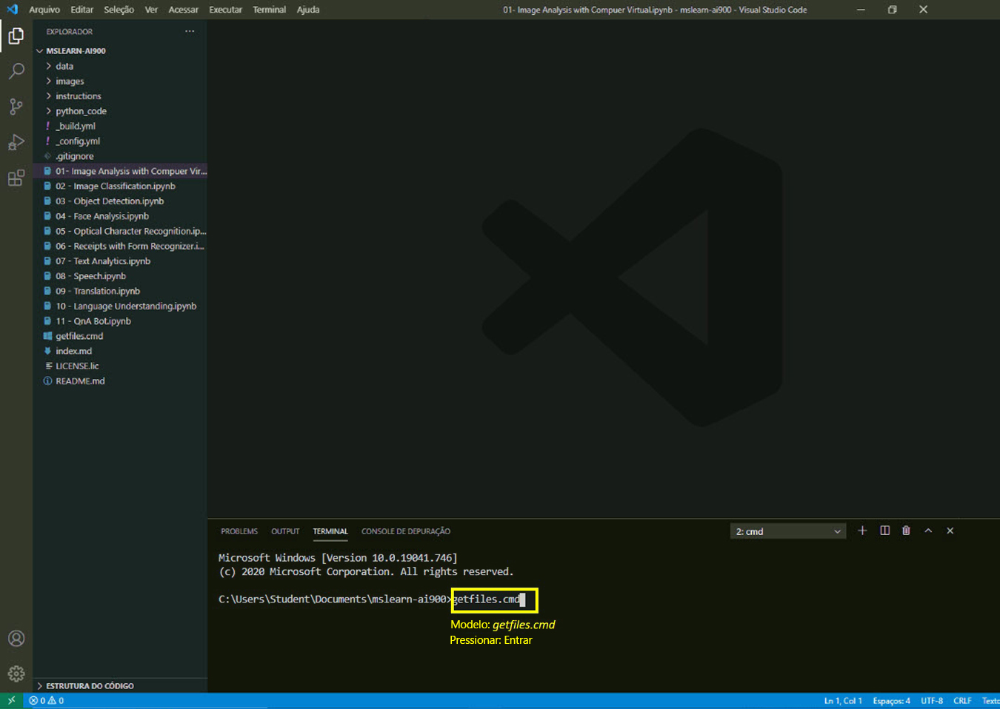

---
lab:
    title: 'Bot de QnA'
---

# Laboratórios AI-900
## Obter arquivos mais recentes

1.  Inicie o Visual Studio Code (o ícone do programa está fixado na barra de tarefas inferior). Quando ele abrir, você deverá ver o projeto MSLEARN-AI900 no painel do lado esquerdo.

2.  Vamos obter a versão mais recente do projeto. No terminal aberto, digite +++getfiles.cmd+++ e pressione **enter**. Este comando extrai a versão mais recente do projeto para a sua pasta. 
3.  Depois que o comando for executado, você poderá fechar o painel do terminal. Agora pode iniciar o laboratório. 

Neste laboratório, criaremos um bot que responde às perguntas dos usuários.

-  Abra o notebook **11 - QnA Bot.ipynb** no Visual Studio Code. 
    **Observação:** Talvez seja solicitado que você preencha uma pesquisa de 2 minutos. Siga em frente e selecione **Não, obrigado(a)**. Pode ser necessário fazer isso mais de uma vez.
-  Siga as instruções do notebook para concluir o laboratório.
